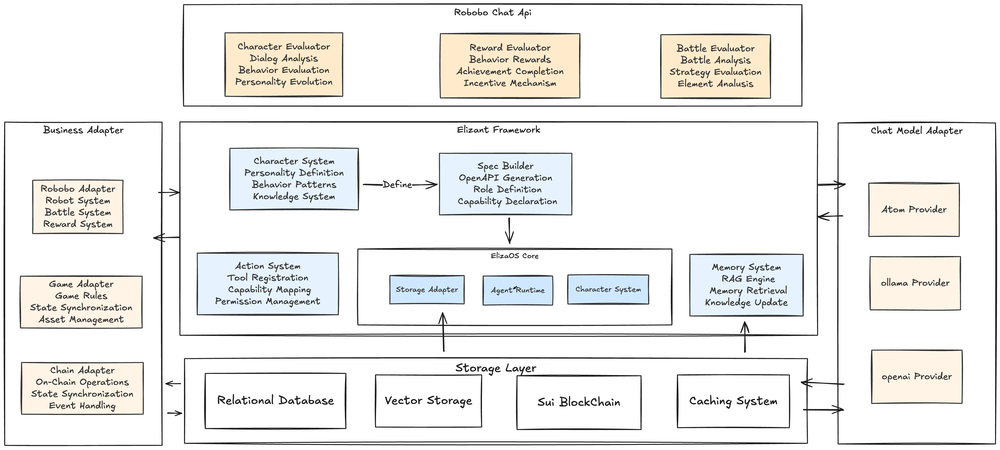
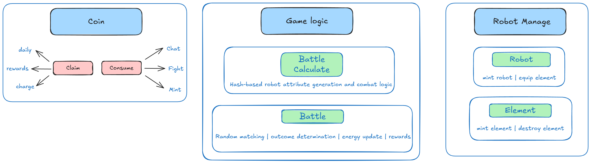
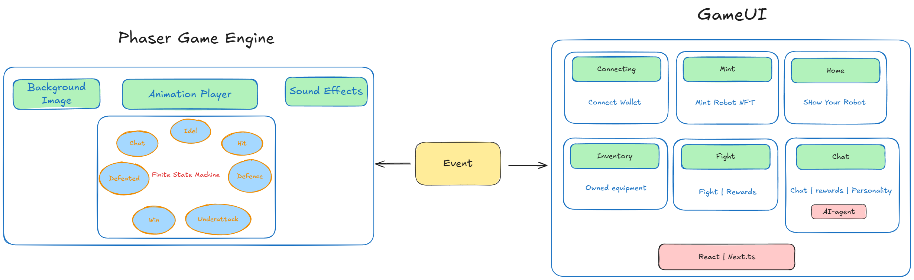

# Robobo

Robobo is an innovative AI-Agent based robot pet battle game built on the Sui blockchain. Each robot is not just an NFT, but an independent AI-Agent that you can chat with, bond with, and take into battles for upgrades and growth.

## 🎮 Core Features

### Fighting 🤖⚔️
- PVP Battle System
- On-chain Real-time Matchmaking
- Victory Rewards: Tokens, Parts, and Status Recovery

### Chat 🗨️💡 (Core Feature)
- Each Robobo is a Unique AI-Agent
- Build Bonds Through Dialogue
- AI Personality Evolution System

### Inventory 🎒
- Parts Management and Equipment System
- Customize Robobo Battle Styles
- Attribute Adjustment and Enhancement

## 🌟 Key Features

### Easy Onboarding
- Support for Wallet and Google Login
- Web3-Friendly User Experience
- Seamless Cross-platform Experience

### AI-Powered
- Unique AI-Agent Personality System
- Deep Conversational Interaction
- Intelligent Battle Analysis

### Growth System
- NFT Character Evolution
- Equipment Collection and Enhancement
- Social Interaction and Quest System

## Project Structure

```
.
├── server/         # Backend Service
├── contract/       # SUI Move Smart Contracts
└── web/            # Frontend & Game Engine
```

## Technical Architecture

### Backend Architecture


### Contract Architecture


### Frontend Architecture


## 🔮 Roadmap

### Short-term Goals
- Enhance Inventory System
- Implement Leaderboard and Reward System
- Improve AI-Agent Conversation Capabilities

### Long-term Goals
- Introduce More AI Interactive Features
- Develop Social Ecosystem
- Build Guild and Team Systems

## 🤝 Join Us

We're exploring the infinite possibilities of AI + Web3 gaming! If you're interested in Robobo, join us in creating the future of Web3 gaming.

## Smart Contracts

<details>
<summary>Click to expand smart contract documentation</summary>

<!-- BEGIN_CONTRACT_DOC -->
The Robobo smart contract system is implemented in Sui Move, providing core game logic including Robot NFT minting, attribute management, battle system, and equipment management.

### Contract Architecture

The contract system consists of the following modules:

```
contract/
├── sources/                    # Contract source code
│   ├── game.move              # Core game logic
│   ├── element.move           # Equipment system
│   ├── robot.move             # Robot NFT implementation
│   ├── battle.move            # Battle system
│   ├── user.move              # User system
│   ├── config.move            # Game configuration
│   └── trash.move             # Token system
├── Move.toml                  # Project configuration
└── tests/                     # Test cases
    ├── game_tests.move
    ├── element_tests.move
    ├── robot_tests.move
    └── battle_tests.move
```

### Core Modules

#### 1. Game Module (`game.move`)
Core game state management and business logic implementation.

##### Key Data Structures
```move
struct GameState has key, store {
    id: UID,
    passports: Table<address, ID>,    // User passport records
    robots: vector<ID>,               // Robot records
    elements: Table<ID, vector<ID>>,  // Equipment records
    total_battles: u64,               // Total battle count
    rankings: Table<ID, u64>          // Leaderboard
}

struct AdminCap has key, store {
    id: UID
}

struct BattleRewardEvent has copy, drop {
    winner_id: ID,
    loser_id: ID,
    token_reward: u64,
    has_element_drop: bool,
    timestamp: u64
}
```

#### 2. Element Module (`element.move`)
Robot equipment system implementation.

##### Key Data Structures
```move
struct Element has key, store {
    id: UID,
    name: String,
    description: String,
    abilities: vector<u8>,  // [Attack, Defense, Speed, Energy, Core]
}
```

##### Attribute System
- 5 Core Attributes: Attack, Defense, Speed, Energy, Core
- Attribute Threshold (ABILITY_THRESHOLD = 128):
  - > 128: Attribute boost
  - < 128: Attribute reduction
- Balance Mechanism: Only one attribute per equipment can exceed threshold

### Core Features

#### 1. User System
- `create_passport`: Create user passport as identity credential
- `claim_daily_token`: Daily TRASH token rewards
- User permission management and state tracking
- On-chain user data storage and verification

#### 2. Robot NFT System
- `mint_robot`: Mint Robot NFT using TRASH tokens
- Robot attribute system:
  - Base attributes: Attack, Defense, Speed, etc.
  - Equipment slots: Different types of equipment
  - Battle records: Win rate, points, etc.
- Robot attribute upgrades and evolution

#### 3. Equipment System
- Five core attributes
- Equipment acquisition:
  - Battle rewards
  - Chat interaction drops
  - System rewards
- Equipment mechanism:
  - TRASH token consumption
  - Attribute stacking
  - Equipment slot restrictions

#### 4. Battle System
- `random_battle`: Random matchmaking
- Battle mechanics:
  - Calculation based on robot attributes and equipment
  - Equipment bonus effects
  - Random factors
- Reward system:
  - Battle points
  - TRASH token rewards
  - Equipment drops
- Leaderboard updates

### Token Economics

#### TRASH Token
- Uses:
  - Robot NFT minting
  - Battle participation
  - Equipment management
  - Attribute upgrades
- Acquisition:
  - Daily sign-in rewards
  - Battle victory rewards
  - Special event rewards
- Token economy:
  - Inflation control
  - Token burn mechanism
  - Reward balance

### Technical Features

#### Security
- Sui Move ownership system for asset security
- Comprehensive permission checks:
  - Admin privileges
  - User operation verification
  - Asset transfer restrictions
- Detailed error handling
- Transaction atomicity guarantee

#### Extensibility
- Modular design for easy feature expansion
- Support for future gameplay:
  - Reserved interfaces
  - Configurable parameters
  - Low module coupling
- Reserved attribute and state expansion space

#### Randomness
- Fair battle matching using Sui on-chain random numbers
- Unpredictable battle results
- Anti-cheating mechanism

### Development Guide

#### Environment Requirements
- Sui Move Compiler
- Move Test Framework
- Sui CLI Tools
- Development IDE (VSCode + Move Plugin recommended)

#### Build & Deploy
```bash
# Build contract
sui move build

# Test
sui move test

# Deploy (network configuration required)
sui client publish --gas-budget 10000
```

#### Testing
```bash
# Run all tests
sui move test

# Run specific tests
sui move test game_tests
sui move test element_tests
sui move test battle_tests
```

### Contract Call Flow

#### 1. Initialization
```move
// 1. Deploy contract
// 2. Initialize game state
fun init(_: GAME, ctx: &mut TxContext)
```

#### 2. User Flow
```move
// 1. Create passport
create_passport(name, game_state, game_config, token_cap, ctx)

// 2. Claim tokens
claim_daily_token(game_config, passport, token_cap, ctx)

// 3. Mint robot
mint_robot(game_state, game_config, robot_pool, robot_name, payment, token_policy, ctx)

// 4. Battle
random_battle(game_state, game_config, robot_pool, robot, payment, token_policy, token_cap, random, clock, ctx)
```

### Error Handling

#### Error Codes
```move
const E_ALREADY_HAS_PASSPORT: u64 = 0;
const E_NO_PASSPORT: u64 = 1;
const E_ALREADY_CLAIMED_TODAY: u64 = 2;
const E_INSUFFICIENT_TRASH: u64 = 3;
const E_INVALID_ELEMENT: u64 = 4;
const E_BATTLE_IN_COOLDOWN: u64 = 5;
```

#### Error Handling Mechanism
- Complete error checking
- Clear error messages
- Transaction rollback protection

### Important Notes

1. All transactions require TRASH tokens
2. Equipment attributes must meet balance requirements
3. Battle results determined by on-chain random numbers
4. Regular game configuration maintenance required
5. Important operations require transaction confirmation
6. Test thoroughly on testnet before mainnet deployment

<!-- END_CONTRACT_DOC -->

For more details, see [contract/README.md](contract/README.md)
</details>

## Web Frontend

<details>
<summary>Click to expand frontend documentation</summary>

<!-- BEGIN_FRONTEND_DOC -->
The Robobo Web frontend is developed using Next.js + React framework, integrating the Phaser game engine to create an NFT-enabled robot pet battle game.

### System Architecture

The system adopts a modular design, consisting of the following core components:

#### Game Engine Layer (Phaser Game Engine)

- **Background System**:
  - Scene rendering
  - Map loading
  - Environmental effects

- **Animation System**:
  - Character animations
  - Special effects
  - State transition animations

- **Sound System**:
  - Background music
  - Battle sound effects
  - Environmental audio

- **State Machine System**:
  - Character state management
  - Battle state transitions
  - Game progress control

#### Game UI Layer

- **Connection Module**:
  - Wallet connection
  - Network status management
  - Account management

- **Minting Module**:
  - NFT minting
  - Robot generation
  - Attribute allocation

- **Home Module**:
  - Robot showcase
  - Status overview
  - Feature navigation

- **Inventory Module**:
  - Equipment management
  - Item management
  - Asset display

- **Battle Module**:
  - Battle matching
  - Battle interface
  - Reward settlement

- **Chat Module**:
  - AI dialogue
  - Reward system
  - Personalized interaction

### Tech Stack

- **Frontend Framework**:
  - Next.js 14
  - React 18
  - TypeScript
  - TailwindCSS

- **Game Engine**:
  - Phaser 3

- **Web3 Integration**:
  - SUI Wallet
  - Web3 API

- **State Management**:
  - React Context
  - Custom Hooks

### Directory Structure

```
web/
├── app/                # Next.js application main directory
│   ├── page.tsx       # Main page
│   ├── layout.tsx     # Layout component
│   └── providers.tsx  # Global providers
├── game/              # Game-related code
│   ├── scenes/        # Game scenes
│   ├── core/          # Core logic
│   ├── gameObject/    # Game objects
│   └── config/        # Configuration files
├── components/        # React components
├── hooks/             # Custom hooks
├── context/          # Global state
├── contracts/        # Smart contract interaction
├── utils/            # Utility functions
└── types/            # Type definitions
```

### Core Features

1. **Wallet Integration**:
   - SUI wallet support
   - Asset management
   - Transaction processing

2. **NFT System**:
   - Robot NFT minting
   - Attribute system
   - Equipment system

3. **Battle System**:
   - PVP battles
   - Reward mechanism
   - Leaderboard

4. **AI Interaction**:
   - Intelligent dialogue
   - Personalized interaction
   - Behavior learning

### Development Guide

1. **Game Scene Development**:
   - Create new scenes in `game/scenes`
   - Extend Phaser.Scene
   - Implement preload/create/update methods

2. **UI Component Development**:
   - Use TailwindCSS styling
   - Follow React component best practices
   - Ensure Web3 functionality compatibility

3. **Contract Interaction**:
   - Use utility functions in `contracts` directory
   - Handle transaction states and errors
   - Implement event listeners

<!-- END_FRONTEND_DOC -->

For more details, see [web/README.md](web/README.md)
</details>


## Backend Service

<details>
<summary>Click to expand backend documentation</summary>

<!-- BEGIN_BACKEND_DOC -->
The Robobo backend service is built on Next.js, implementing an AI-powered robot pet battle game server with dialogue system, personality evolution, and battle analysis capabilities.

### System Architecture

The system adopts a layered architecture design with the following core modules:

#### Elizant Framework (Core Framework)

Elizant is a flexible Agent framework that manages and coordinates various subsystems:

- **Character System**: 
  - Robot personality definition
  - Behavior pattern management
  - Knowledge system integration
  
- **Spec Builder**:
  - OpenAPI specification generation
  - Role definition
  - Capability declaration management

- **Action System**:
  - Tool registration
  - Capability mapping
  - Permission management

- **Memory System**:
  - RAG engine
  - Memory retrieval
  - Knowledge update

#### Evaluators

- **Character Evaluator**:
  - Dialogue analysis
  - Behavior assessment
  - Personality evolution evaluation

- **Reward Evaluator**:
  - Behavior reward calculation
  - Achievement completion
  - Incentive mechanism management

- **Battle Evaluator**:
  - Battle analysis
  - Strategy evaluation
  - Element analysis

#### Adapters Layer

- **Business Adapter**: Business logic adaptation
- **Chat Model Adapter**: AI model integration
- **Chain Adapter**: Blockchain interaction

#### Storage Layer

- Relational Database: Structured data storage
- Vector Database: Semantic vector storage
- SUI Blockchain: On-chain data storage
- Caching System: Performance optimization

### Module Status

#### Storage Layer
- Relational Database [WIP]
- Vector Database Integration [TODO]
- SUI Chain Interaction [WIP]
- Caching System [TODO]

#### Elizant Framework
- Spec Builder [WIP]
- Character System [TODO]
- Action System [TODO]
- Memory System [TODO]
- Agent Runtime [WIP]

#### Evaluators
- Character Evaluator [TODO]
- Battle Evaluator [TODO]
- Reward Evaluator [TODO]

#### Adapters Layer
- Chat Model Adapter [WIP]
- Business Adapter [WIP]
- Blockchain Adapter [WIP]

[WIP] - Work In Progress
[TODO] - Not Started

<!-- END_BACKEND_DOC -->

For more details, see [server/README.md](server/README.md)
</details>


## Development

See individual component directories for development instructions:

- [Backend Development](server/README.md)
- [Smart Contract Development](contract/README.md)
- [Frontend Development](web/README.md)